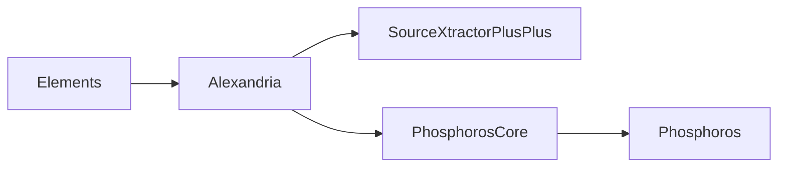

Out [GitHub actions](https://github.com/astrorama/actions) are set to
build and upload RPMs to [repository.astro.unige.ch](http://repository.astro.unige.ch/euclid/).
See [GitHub repositories / Actions](/docs/astrorama/github#actions) for an
explanation of each action.

We also use the third-party [get-fedora-releases-action](https://github.com/sgallagher/get-fedora-releases-action)
to retrieve the list of stable Fedoras and build for them. However, Centos7 is
manually specified for each project, on its workflow file `main.yaml`.

Note that [repository.astro.unige.ch](http://repository.astro.unige.ch/euclid/)
points to the public facing web server, which is not accesible by ssh.
`repo01.astro.unige` must be used instead. However, this one is *only*
accessible from within the university network, so you will need to login first
into, or proxy the connection via, `login01.astro.unige.ch`. You can do this
by modifying `${HOME}/.ssh/config` and adding the following:

```ssh
Host repo01.astro.unige.ch # You can also use wildcards !login*.astro.unige.ch *.astro.unige.ch
    ForwardAgent yes
    ProxyJump login02.astro.unige.ch
```

The contents of the repository are under `/srv/repository/www/html/euclid`:

<pre><font color="#005FFF">centos</font>
<font color="#005FFF">devel</font>
<font color="#005FFF">fedora</font>
<font color="#005FFF">sources</font>
</pre>

`centos` and `fedora` contain the RPMs for the released versions.
`devel` contain *non-tagged* versions:

<pre><font color="#005FFF">develop</font>
<font color="#005FFF">pull</font>
<font color="#005FFF">stable</font></pre>

`develop` corresponds to the `develop` branch, `stable` to `master`, and
`pull` RPMs build for pull requests (i.e. `pull/Alexandria/118`).

The structure under each one of those is identical to the root: `centos`,
`fedora`. The substructure looks like:

<pre><font color="#005FFF">centos/7</font>
├── <font color="#005FFF">SRPMS</font>
│   ├── <font color="#EF2929">Alexandria-2.27-dev.el7.src.rpm</font>
│   ├── <font color="#EF2929">PhosphorosCore-1.4-dev.el7.src.rpm</font>
│   ├── <font color="#005FFF">repodata</font>
│   ├── <font color="#005FFF">repoview</font>
│   └── <font color="#EF2929">SourceXtractorPlusPlus-0.19-dev.el7.src.rpm</font>
└── <font color="#005FFF">x86_64</font>
    ├── <font color="#EF2929">Alexandria-2.27-dev.el7.x86_64.rpm</font>
    ├── <font color="#EF2929">Alexandria-debuginfo-2.27-dev.el7.x86_64.rpm</font>
    ├── <font color="#EF2929">Alexandria-devel-2.27-dev.el7.x86_64.rpm</font>
    ├── <font color="#EF2929">Alexandria-doc-2.27-dev.el7.x86_64.rpm</font>
    ├── <font color="#005FFF">debug</font>
    │   ├── <font color="#EF2929">Alexandria-debuginfo-2.27-dev.el7.x86_64.rpm</font>
    │   ├── <font color="#EF2929">PhosphorosCore-debuginfo-1.4-dev.el7.x86_64.rpm</font>
    │   ├── <font color="#005FFF">repodata</font>
    │   ├── <font color="#005FFF">repoview</font>
    ├── <font color="#EF2929">PhosphorosCore-1.4-dev.el7.x86_64.rpm</font>
    ├── <font color="#EF2929">PhosphorosCore-debuginfo-1.4-dev.el7.x86_64.rpm</font>
    ├── <font color="#EF2929">PhosphorosCore-devel-1.4-dev.el7.x86_64.rpm</font>
    ├── <font color="#EF2929">PhosphorosCore-doc-1.4-dev.el7.x86_64.rpm</font>
    ├── <font color="#005FFF">repodata</font>
    ├── <font color="#005FFF">repoview</font>
    ├── <font color="#EF2929">SourceXtractorPlusPlus-0.19-dev.el7.x86_64.rpm</font>
    ├── <font color="#EF2929">SourceXtractorPlusPlus-debuginfo-0.19-dev.el7.x86_64.rpm</font>
    ├── <font color="#EF2929">SourceXtractorPlusPlus-devel-0.19-dev.el7.x86_64.rpm</font>
    └── <font color="#EF2929">SourceXtractorPlusPlus-doc-0.19-dev.el7.x86_64.rpm</font>
<font color="#005FFF">fedora/35</font>
├── <font color="#005FFF">SRPMS</font>
│   ├── <font color="#EF2929">Alexandria-2.27-dev.fc35.src.rpm</font>
│   ├── <font color="#EF2929">Phosphoros-1.4-dev.fc35.src.rpm</font>
│   ├── <font color="#EF2929">PhosphorosCore-1.4-dev.fc35.src.rpm</font>
│   ├── <font color="#005FFF">repodata</font>
│   ├── <font color="#005FFF">repoview</font>
│   └── <font color="#EF2929">SourceXtractorPlusPlus-0.19-dev.fc35.src.rpm</font>
└── <font color="#005FFF">x86_64</font>
    ├── <font color="#EF2929">Alexandria-2.27-dev.fc35.x86_64.rpm</font>
    ├── <font color="#EF2929">Alexandria-debuginfo-2.27-dev.fc35.x86_64.rpm</font>
    ├── <font color="#EF2929">Alexandria-debugsource-2.27-dev.fc35.x86_64.rpm</font>
    ├── <font color="#EF2929">Alexandria-devel-2.27-dev.fc35.x86_64.rpm</font>
    ├── <font color="#EF2929">Alexandria-doc-2.27-dev.fc35.x86_64.rpm</font>
    ├── <font color="#005FFF">debug</font>
    │   ├── <font color="#EF2929">Alexandria-debuginfo-2.27-dev.fc35.x86_64.rpm</font>
    │   ├── <font color="#EF2929">Alexandria-debugsource-2.27-dev.fc35.x86_64.rpm</font>
    │   ├── <font color="#EF2929">PhosphorosCore-debuginfo-1.4-dev.fc35.x86_64.rpm</font>
    │   ├── <font color="#EF2929">PhosphorosCore-debugsource-1.4-dev.fc35.x86_64.rpm</font>
    │   ├── <font color="#EF2929">Phosphoros-debuginfo-1.4-dev.fc35.x86_64.rpm</font>
    │   ├── <font color="#EF2929">Phosphoros-debugsource-1.4-dev.fc35.x86_64.rpm</font>
    │   ├── <font color="#005FFF">repodata</font>
    │   ├── <font color="#005FFF">repoview</font>
    │   ├── <font color="#EF2929">SourceXtractorPlusPlus-debuginfo-0.19-dev.fc35.x86_64.rpm</font>
    │   └── <font color="#EF2929">SourceXtractorPlusPlus-debugsource-0.19-dev.fc35.x86_64.rpm</font>
    ├── <font color="#EF2929">Phosphoros-1.4-dev.fc35.x86_64.rpm</font>
    ├── <font color="#EF2929">PhosphorosCore-1.4-dev.fc35.x86_64.rpm</font>
    ├── <font color="#EF2929">PhosphorosCore-debuginfo-1.4-dev.fc35.x86_64.rpm</font>
    ├── <font color="#EF2929">PhosphorosCore-debugsource-1.4-dev.fc35.x86_64.rpm</font>
    ├── <font color="#EF2929">PhosphorosCore-devel-1.4-dev.fc35.x86_64.rpm</font>
    ├── <font color="#EF2929">PhosphorosCore-doc-1.4-dev.fc35.x86_64.rpm</font>
    ├── <font color="#EF2929">Phosphoros-debuginfo-1.4-dev.fc35.x86_64.rpm</font>
    ├── <font color="#EF2929">Phosphoros-debugsource-1.4-dev.fc35.x86_64.rpm</font>
    ├── <font color="#EF2929">Phosphoros-devel-1.4-dev.fc35.x86_64.rpm</font>
    ├── <font color="#EF2929">Phosphoros-doc-1.4-dev.fc35.x86_64.rpm</font>
    ├── <font color="#005FFF">repodata</font>
    ├── <font color="#005FFF">repoview</font>
    ├── <font color="#EF2929">SourceXtractorPlusPlus-0.19-dev.fc35.x86_64.rpm</font>
    ├── <font color="#EF2929">SourceXtractorPlusPlus-debuginfo-0.19-dev.fc35.x86_64.rpm</font>
    ├── <font color="#EF2929">SourceXtractorPlusPlus-debugsource-0.19-dev.fc35.x86_64.rpm</font>
    ├── <font color="#EF2929">SourceXtractorPlusPlus-devel-0.19-dev.fc35.x86_64.rpm</font>
    └── <font color="#EF2929">SourceXtractorPlusPlus-doc-0.19-dev.fc35.x86_64.rpm</font>
</pre>

`repodata` is updated by [`createrepo`](https://linux.die.net/man/8/createrepo),
and `repoview` by [`repoview`](https://linux.die.net/man/8/repoview).
They are automatically run by the CI, but they can also be manually run:

```bash
createrepo -v --update .
repoview .
```

This repository can be used from Fedora or Centos7 adding a `.repo` file
to your system:

```ini
# Stable and tagged versions
[Astrorama]
name=Astrorama
baseurl=http://repository.astro.unige.ch/euclid/fedora/$releasever/$basearch
enabled=1
gpgcheck=0


# Enable this to get the development version
[Astrorama-Develop]
name=Astrorama Develop
baseurl=http://repository.astro.unige.ch/euclid/devel/develop/fedora/$releasever/$basearch
enabled=0
gpgcheck=0
```

<article class="message is-warning">
  <div class="message-body" markdown="1">
Enabling this `.repo` file can introduce conflicts with the versions
shipped directly in Fedora. See [Troubleshooting](#troubleshooting)
for more information.
  </div>
</article>

## New Fedora release

When a new Fedora version is released, the first builds may fail since
the repository will not exist in [repository.astro.unige.ch](http://repository.astro.unige.ch/euclid/).

You will need to `ssh` into `repo01.astro.unige.ch` and pre-populate the structure:

```bash
ssh repo01.astro.unige.ch
cd /srv/repository/www/html/euclid
FEDORA=37 # For instance
for parent in . devel/stable devel/develop; do
  for repo in SRPMS x86_64 x86_64/debug; do
    dir="${parent}/fedora/${FEDORA}/${repo}"
    mkdir -p "${dir}"
    (cd "${dir}"; createrepo .; repoview .)
  done
done
```

Then, you will need to trigger the GitHub actions for each project
following the order of the dependencies:





## Official Fedora and EPEL packages

[Elements](https://packages.fedoraproject.org/pkgs/elements/elements/),
[Alexandria](https://packages.fedoraproject.org/pkgs/elements/elements-alexandria/)
and [SourceXtractor++](https://packages.fedoraproject.org/pkgs/sourcextractor++/sourcextractor++/)
are shipped through the Fedora repositories. Only the Fedora maintainer(s)
can trigger builds there.

## Troubleshooting

When the `astrorama.repo` file is enabled, there can be conflicts since the
packages in Fedora and those from [repository.astro.unige.ch](http://repository.astro.unige.ch/euclid/)
do not have the same name:

| repository.astro.unige.ch | Fedora              |
|---------------------------|---------------------|
| Elements                  | elements            |
| Alexandria                | elements-alexandria |
| SourceXtractorPlusPlus    | sourcextractor++    |
| PhosphorosCore            | n/a                 |
| Phosphoros                | n/a                 |

This is because Fedora guidelines specify that the package name must be
lowercase, while Euclid capitalizes the project names.

Therefore, as far as `dnf` is concerned, those are different RPMs that provide
the same set of files. It may *try* to install them together (different names),
but fail. It will then complain that it can not satisfy the dependencies of,
say, `PhosphorosCore`.

If you want to install from [repository.astro.unige.ch](http://repository.astro.unige.ch/euclid/),
it is advisable to either `exclude` the packages from the Fedora repo:

```ini
# Add this to /etc/yum.repos.d/fedora.repo under [fedora] and /etc/yum.repos.d/fedora-updates.repo under [updates]
exclude=elements* sourcextractor++
```

Or [modify the priority](https://dnf.readthedocs.io/en/latest/conf_ref.html#repo-priority-label)
of `astrorama.repo` and install only from there (i.e., remove any installed
packages listed under the "Fedora" column):

```ini
[Astrorama]
name=Astrorama
baseurl=http://repository.astro.unige.ch/euclid/fedora/$releasever/$basearch
enabled=1
gpgcheck=0
# Lowest value is picked first. Default is 99.
priority=10
```
