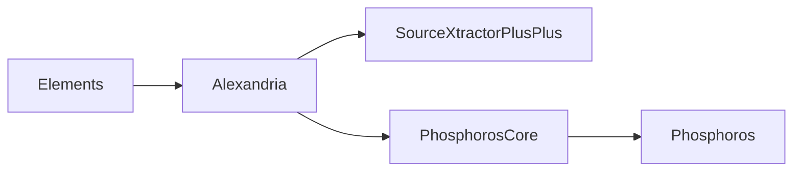

GitHub Actions will automatically build new RPMs when a version
is tagged, and deploy them to the [Astrorama repository](/docs/astrorama/fedora).

There is generally no need for manual intervention, except on the following
cases:

## New Fedora release

When a new Fedora version is released, the first builds may fail since
the repository will not exist in [repository.astro.unige.ch](http://repository.astro.unige.ch/euclid/).

You will need to `ssh` into `repo01.astro.unige.ch` and pre-populate the structure:

```bash
ssh repo01.astro.unige.ch
cd /srv/repository/www/html/euclid
FEDORA=37 # For instance
for parent in . devel/stable devel/develop; do
  for repo in SRPMS x86_64 x86_64/debug; do
    dir="${parent}/fedora/${FEDORA}/${repo}"
    mkdir -p "${dir}"
    (cd "${dir}"; createrepo .; repoview .)
  done
done
```

Then, you will need to trigger the GitHub actions for each project
following the order of the dependencies:





## Official Fedora and EPEL packages

[Elements](https://packages.fedoraproject.org/pkgs/elements/elements/),
[Alexandria](https://packages.fedoraproject.org/pkgs/elements/elements-alexandria/)
and [SourceXtractor++](https://packages.fedoraproject.org/pkgs/sourcextractor++/sourcextractor++/)
are shipped through the Fedora repositories. Only the Fedora maintainer(s)
can trigger builds there.

## Troubleshooting

### Incompatible values of SGS_SYSTEM

An error like

```
CMake Error at /usr/lib64/cmake/ElementsProject/ElementsProjectConfig.cmake:1567 (message):
  Incompatible values of SGS_SYSTEM:
    SourceXtractorPlusPlus -> x86_64-fc37-gcc122
    Alexandria 2.25.0 -> x86_64-fc37-gcc121
```

likely means that Fedora has updated the compiler, and Alexandria was built
with the previous version. You will need to rebuild the dependencies
in the order shown [previously](#new-fedora-release). You can use
[`build-rpm.sh`](https://github.com/astrorama/Alexandria/blob/develop/build-rpm.sh)
passing as an argument a new release number:

```bash
./build-rpm.sh 2
```

You will then need to copy the resulting RPMs to the appropriate directory
in `repo01.astro.unige.ch` and run `createrepo -v --update .` and `repoview .`.
